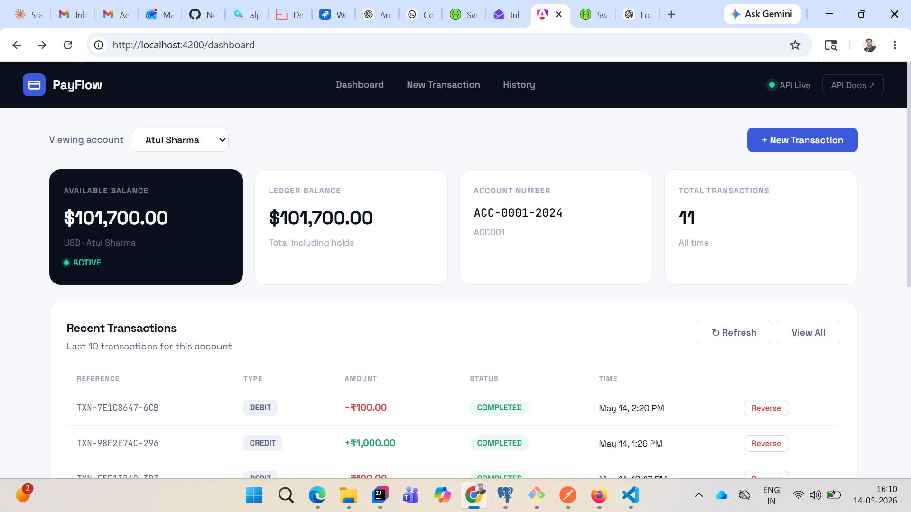
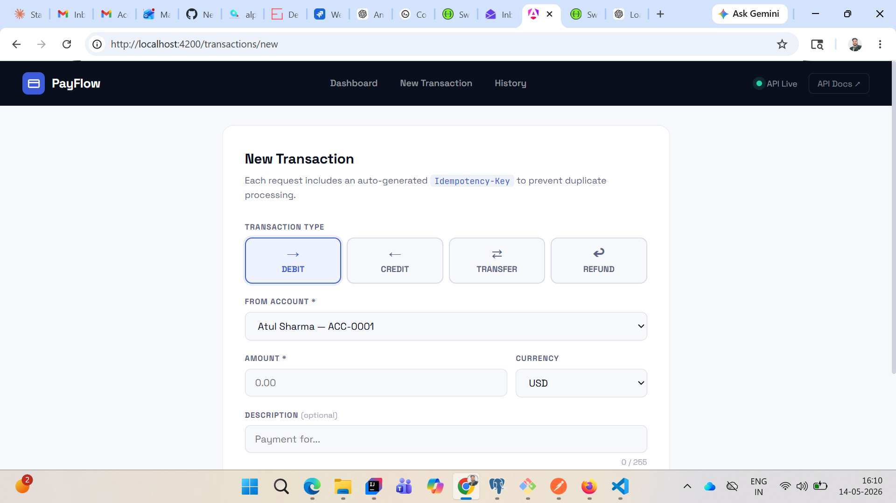
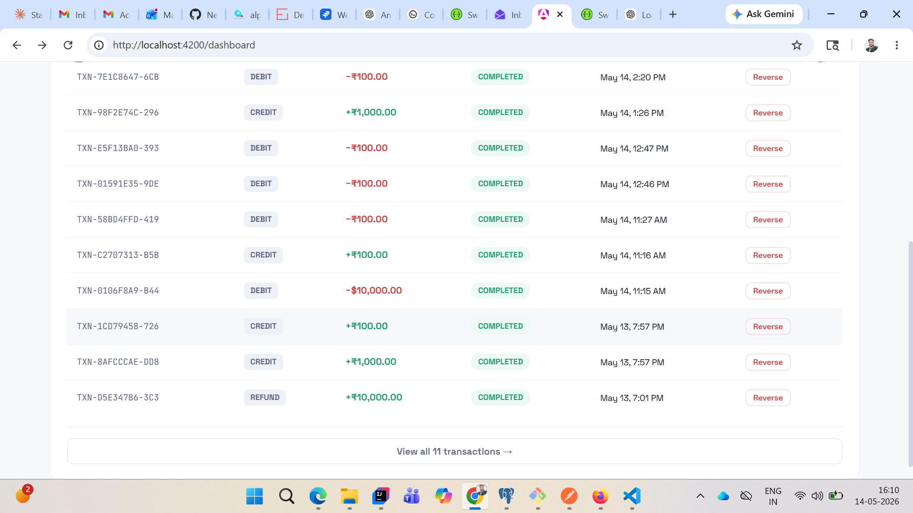

# 💳 Payment Transaction Module

**Backend:** Spring Boot 3.2 + Java 21 | **Frontend:** Angular 17 | **DB:** PostgreSQL 15

---

## Features
- DEBIT, CREDIT, TRANSFER, REFUND transactions
- Idempotency keys — no duplicate charges
- Optimistic + Pessimistic locking for concurrency
- Daily spend limits & rate limiting (50 txn/hour)
- Transaction reversal support
- Real-time balance dashboard
- Global error handling with structured JSON responses

---

## Tech Stack

| Layer | Technology |
|---|---|
| Backend | Spring Boot 3.2, Java 21, Lombok |
| Database | PostgreSQL 15 |
| ORM | Spring Data JPA + Flyway |
| Frontend | Angular 17, Angular Material |
| Build | Maven 3.9 |
| Docs | Swagger UI |

---

## Quick Start

### 1. Database
```sql
CREATE DATABASE payment_db;
CREATE USER payment_user WITH PASSWORD 'payment_pass';
GRANT ALL PRIVILEGES ON DATABASE payment_db TO payment_user;
```

### 2. Backend
```bash
cd backend
mvn spring-boot:run
# API → http://localhost:8080
# Swagger → http://localhost:8080/swagger-ui.html
```

### 3. Frontend
```bash
npm install
ng serve --proxy-config proxy.conf.json
# App → http://localhost:4200
```

---

## API Endpoints

| Method | Endpoint | Description |
|---|---|---|
| `POST` | `/api/v1/payments/transactions` | Create transaction |
| `GET` | `/api/v1/payments/transactions/{id}` | Get by ID |
| `POST` | `/api/v1/payments/transactions/{id}/reverse` | Reverse transaction |
| `GET` | `/api/v1/payments/accounts/{id}/balance` | Account balance |
| `GET` | `/api/v1/payments/accounts/{id}/transactions` | Transaction history |

### Sample Request
```http
POST /api/v1/payments/transactions
Content-Type: application/json
Idempotency-Key: <uuid>

{
  "accountId": "ACC001",
  "toAccountId": "ACC002",
  "amount": 1500.00,
  "currency": "USD",
  "type": "TRANSFER",
  "description": "Invoice payment"
}
```

---

## Screenshots

### Dashboard


### Create Transaction


### Transaction History


---

## Concurrency Strategy

| Layer | Mechanism |
|---|---|
| Optimistic Lock | `@Version` on all entities |
| Pessimistic Lock | `SELECT FOR UPDATE` on balance updates |
| Deadlock Prevention | Canonical lock ordering for transfers |
| Rate Limiting | Per-account `Semaphore` (max 3 concurrent) |
| Auto Retry | `@Retryable` with exponential backoff |

---

## Error Handling

All errors return a consistent JSON structure:
```json
{
  "errorId": "uuid",
  "code": "INSUFFICIENT_FUNDS",
  "message": "Available: $500.00, Requested: $1500.00",
  "timestamp": "2024-01-15T10:30:45"
}
```

---

## Project Structure
```
payment-system/
├── backend/
│   └── src/main/java/com/payment/
│       ├── controller/     ← REST endpoints
│       ├── service/        ← Business logic + locking
│       ├── entity/         ← JPA entities
│       ├── repository/     ← DB queries
│       ├── exception/      ← Error handling
│       └── dto/            ← Request/Response
├── src/app/                ← Angular frontend
│   ├── components/         ← Dashboard, Form, History
│   ├── services/           ← API calls + notifications
│   └── interceptors/       ← HTTP retry + tracking
└── docker-compose.yml
```

---

## Docker (Optional)
```bash
docker-compose up --build
```

---

*Submitted by **Atul Sharma** — Spring Boot 3.2 + Angular 17 + PostgreSQL 15*
